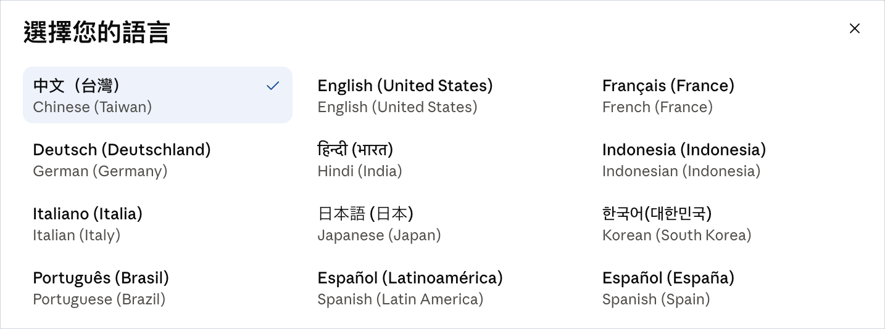

# Claude Desktop 繁体中文（台湾）

由 **南山网络** 制作与维护 · [nanshanproxy.com](https://nanshanproxy.com/)

在 Claude Desktop 的语言菜单里新增一个 **中文（台灣）** 选项，英文与其他已有语言全部保留。



这是一个真正的新语言条目，不是占用已有语言的位置。语言代码交给系统解析，所以菜单会自己显示成「中文（台灣）」和英文对照的「Chinese (Taiwan)」，排版、排序、勾选状态都与官方内置语言一致。

> ### 系统要求
>
> **仅支持 macOS。Windows 与 Linux 无法使用。**
>
> 本工具依赖 `codesign`（重新签名）、`launchctl`（后台服务）、macOS 钥匙串以及
> `/Applications` 的 App Bundle 结构。这些是 macOS 专有机制，其他系统没有对应
> 实现，无法移植。
>
> - 开发与测试环境：macOS 26.5、Apple Silicon
> - Intel Mac 理论上可用（处理通用二进制文件），但未经实测
> - 需要已安装 Claude Desktop

---

<div align="center">

### 感谢 南山网络 提供网络技术支持服务

### [nanshanproxy.com](https://nanshanproxy.com/)

</div>

---

## 快速开始

1. 点右上角 **Code → Download ZIP**，下载后解压

2. **先加上执行权限。** 打开「终端」（启动台 → 其他 → 终端），粘贴这一行后按 Enter：

   ```
   chmod +x ~/Downloads/claude-desktop-zhtw-mac-main/*.command
   ```

   如果你解压到别的位置，把 `chmod +x ` 打完（结尾留一个空格），从访达把解压出来的文件夹拖进终端窗口，再补上 `/*.command` 按 Enter。

3. 双击 **`安裝繁體中文.command`**

4. 阅读屏幕上的说明，输入 `y` 确认

5. 等待 1-3 分钟（重新签名需要时间）

6. 自己打开 Claude，首次打开时输入一次 Mac 登录密码，选**永久生效的那个允许按钮**（英文系统显示为 Always Allow）

要卸载时，双击 **`還原官方版.command`**。

> 这两个脚本的文件名是繁体字，不是排版错误 —— 仓库里就是这个名字，照着找即可。

> **为什么需要第 2 步：** GitHub 生成的 ZIP 不保留文件的执行权限，少了这一步，双击只会看到 `Permission denied`。如果你是通过隔空投送、U 盘或文件共享直接拿到整个文件夹，权限通常已保留，可以跳过第 2 步。

> 首次双击如果出现「无法打开，因为来自身份不明的开发者」之类的提示，请在该文件上按住 Control 点击，选「打开」，再在对话框里确认。

---

## 这是什么

Claude Desktop 官方支持 11 种语言，不含中文。本工具在语言菜单新增「中文（台灣）」，并提供 25,567 条界面字符串的翻译。

| 范围 | 覆盖率 |
|---|---|
| 主界面 | 100% |
| 模型菜单 | 100% |
| 桌面外壳与设置页 | 100% |

译自英文原文，不是简转繁的机器转换。术语按 400 条台湾词汇表统一，用的是台湾说法而不是大陆说法：螢幕（屏幕）／軟體（软件）／檔案（文件）／預設（默认）／資料夾（文件夹）／權限／連接器／專案（项目）／工作階段（会话）。Claude、Artifact、Cowork、MCP、API、Opus、Sonnet、Token 等保持原文。

装好后的语言菜单见本页最上方的截图：新增的「中文（台灣）」排在第一个，官方原有的 11 种语言一个都没有被取代或移除。

---

## 工作原理

Claude 的主界面是从 `claude.ai` 在线加载的，并没有打包在 App 里。本工具在 Electron 主进程拦截 Claude 自己的语言文件请求，把繁体中文的语言包交给 Claude 内置的 React i18n 系统渲染 —— 和官方语言走的是同一条路径。

这不是界面文字替换，因此不会闪烁、不会漏字、不会与输入法冲突。

拦截范围只有三种请求：语言文件、账号启动数据，以及在线资源中含语言列表的那一个文件。其余一律原样通过。

---

## 代价

**请在安装前读完这一节。**

### 1. 更新来源验证会放宽

Claude 用 Squirrel 做内置更新，它会拿「正在运行的 App 的签名要求」去验证下载回来的更新包。本工具重新签名之后，这项验证原本会永远失败，导致内置更新彻底不可用。

为了让内置更新继续能用，本工具在签名里写入了一条放宽的要求：

```
(Anthropic 官方证书)  或  (相同 bundle id 且非 Apple 锚定)
```

左半让官方更新能验过，右半让本工具自己的版本也满足。

**代价是：** 任何「声明相同 bundle id 且未经 Apple 签名」的代码都能通过这项验证。也就是说，能往 Claude 更新缓存目录写文件的人，可以放一份未签名的假更新进去。

前提是对方已经能在你的账号下执行代码并写文件 —— 到那个地步，对方有更省事的攻击手段。这是知情之后选择的取舍；不接受的话，请不要安装。

### 2. 部分功能失效

以下功能依赖两个绑定 Anthropic 苹果团队身份的 entitlement，重新签名时必须剥除，否则系统会在启动那一刻直接终止进程：

- WebAuthn／硬件密钥登录
- Microsoft SSO
- Cowork VM 沙箱

改用密码或 Google 登录不受影响。

### 3. 每次安装后要输入一次钥匙串密码

Claude 用一把存在 macOS 钥匙串里的密钥加密登录状态。访问权限绑在 App 的签名哈希上，而重新签名会改变哈希，因此每次安装后首次打开 Claude 时，macOS 会要一次密码。

安装脚本会在重新签名后自动更新这把密钥的访问权限，这一步同样需要你的密码。密码由 Apple 的 `security` 工具直接读取，不经过本工具，也不会出现在进程列表里。

对话框会给出两个允许按钮：一个只对这一次有效，另一个永久有效（英文系统显示为 **Always Allow**）。**请选永久有效的那个** —— 选成只允许一次的，下次打开还会再问一遍。

不输入也可以，Claude 照样能用，只是需要重新登录。

**唯一能彻底消除这个提示的办法是 Apple Developer ID 证书**（开发者账号约 US$99/年），它能提供稳定的签名身份。本工具没有使用，因为那会要求每一位用户都自备证书。

---

## Claude 更新之后

Claude 的内置更新可以正常使用。更新完成后，App 会被官方版覆盖，界面变回英文 —— 这是正常结果，不是故障。

安装时会一并装上一个后台服务，它检测到这种情况时会发一条通知。收到通知后，再双击一次 `安裝繁體中文.command` 就能把繁体中文补回来。

这个后台服务：

- 只发通知，不会自行重新安装或重新签名
- 没有定时器，平时完全不占资源
- 你可以无视通知，Claude 会保持英文正常运行
- 运行 `還原官方版.command` 会把它一并移除

翻译记忆以**英文原文**为索引，不受 Claude 内部改版影响。因此更新后绝大多数字符串会直接沿用，只有新增的英文会暂时保持原文。

---

## 登录状态

如果你在使用中发现偶尔掉登录，通常是因为密钥的访问权限没更新（见「代价」第 3 点）。运行下面这条命令补上，之后不会再发生：

```bash
security set-generic-password-partition-list \
  -s 'Claude Safe Storage' -a 'Claude Key' \
  -S "cdhash:$(codesign -dvvv /Applications/Claude.app 2>&1 | sed -n 's/^CDHash=//p'),teamid:Q6L2SF6YDW"
```

---

## 换一台电脑

整个文件夹复制过去，双击 `安裝繁體中文.command` 即可。内容里不含任何绑定特定用户的路径。

---

## 进阶命令

装好后工具位于 `~/claude-zhtw/`：

```bash
~/claude-zhtw/bin/patch-claude status      # 版本、签名、是否已应用、后台服务
~/claude-zhtw/bin/patch-claude install     # 安装（--dry-run 只试跑，不动 App）
~/claude-zhtw/bin/patch-claude uninstall   # 还原官方版
~/claude-zhtw/bin/patch-claude adapt       # Claude 更新后把繁体中文补回来
~/claude-zhtw/bin/patch-claude verify      # 重跑一次界面健康检查
~/claude-zhtw/bin/patch-claude rearm       # 解除自我停用状态
```

### 补翻新版新增的字符串

```bash
~/claude-zhtw/bin/patch-claude sync
# 生成 pending.json，内容为 {类别: {英文: 英文}}
# 把值翻成繁体中文，存成 {英文: 中文} 的 JSON
~/claude-zhtw/bin/patch-claude merge 你的翻译.json
~/claude-zhtw/bin/patch-claude install
```

翻译时请遵循 `payload/glossary.tsv` 的术语规范，并保留 ICU 消息语法（`{count, plural, one {…} other {…}}` 里的 `plural`、`one`、`other` 是语法，不能翻译）。

---

## 免责声明

**本工具由南山网络独立制作，与 Anthropic 没有任何从属、合作或授权关系。**「Claude」是 Anthropic 的商标，本项目仅为说明用途而提及。

本工具会修改 `/Applications/Claude.app` 的内容并重新签名。这项操作会：

- 使 App 的代码签名不再是 Anthropic 官方签名
- 放宽内置更新的来源验证（见「代价」第 1 点）
- 使部分依赖官方签名身份的功能失效（见「代价」第 2 点）

**使用本工具即表示你已阅读并理解上述影响，并自行承担全部风险。** 南山网络不对因使用本工具而导致的任何数据丢失、功能异常、账号问题或其他损害负责。

本工具按「现状」提供，不附带任何明示或默示的担保。

每次安装都会把原版备份到 `/Applications/Claude.backup-before-zhTW-<时间戳>.app`，随时可以通过 `還原官方版.command` 还原。

如果你所处的环境对应用程序完整性有合规要求（企业受管设备、信息安全政策等），请先跟你的 IT 部门确认后再安装。

---

## 许可

翻译内容与脚本以 MIT 许可发布。

Claude Desktop 本身的所有权利归 Anthropic 所有，本项目不包含、不分发任何 Anthropic 的代码或资产。

---

<div align="center">

感谢 **南山网络** 提供网络技术支持服务

**[nanshanproxy.com](https://nanshanproxy.com/)**

</div>
